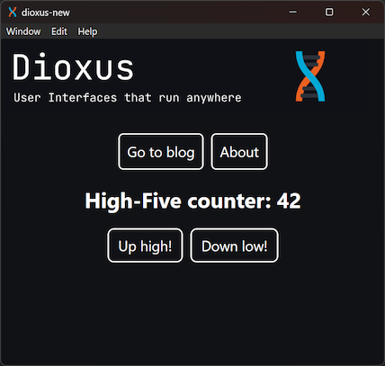

# Dioxus Desktop Template

## Summary

This is a [Dioxus](https://dioxuslabs.com) desktop application template with "vanilla" CSS-styling. It fixes and improves upon what `dx v0.5.4` generates which is very lacking in the styling department (see https://github.com/DioxusLabs/dioxus/issues/2345). So far the template was only tested on Windows 11.

## Development

Run the following command in the root of the project to start the Dioxus dev server:

```bash
dx serve
```

If platform and hot-reloading are not picked up automatically then use:

```bash
dx serve --hot-reload --platform desktop
```

## Screenshots


